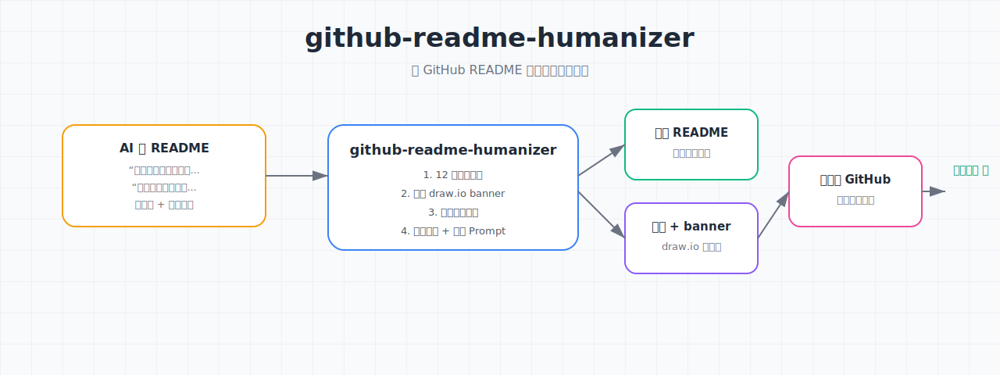

<p align="center">
  <a href="README.en.md">English</a> | <a href="README.md">中文</a>
</p>

<p align="center">
  
</p>

<h1 align="center">github-readme-humanizer</h1>

<p align="center">让 GitHub README 读起来像真人写的。</p>

<p align="center">
  <a href="LICENSE"></a>
  <a href="https://github.com/ECdison6227/github-readme-humanizer/actions/workflows/validate.yml"></a>
  <a href="https://github.com/ECdison6227/github-readme-humanizer/stargazers"></a>
</p>

## 目录

- [一键使用](#一键使用)
- [为什么要做这个](#为什么要做这个)
- [能做什么 / 不能做什么](#能做什么--不能做什么)
- [快速开始](#快速开始)
- [完整案例](#完整案例)
- [它是怎么工作的](#它是怎么工作的)
- [关键配置](#关键配置)
- [我们踩过的坑](#我们踩过的坑)
- [限制与后续](#限制与后续)
- [致谢](#致谢)
- [交流和反馈](#交流和反馈)
- [License](#license)

## 一键使用

如果你不想手动配置，直接把下面这段 prompt 发给你的 Coding Agent（Trae / Codex / Claude Code），它会自动克隆仓库、安装 skill，并告诉你怎么用：

```text
请帮我安装并配置 https://github.com/ECdison6227/github-readme-humanizer 这个 skill：

1. 先 git clone 到本地 skill 目录（如 ~/.trae-cn/skills/github-readme-humanizer）
2. 阅读 SKILL.md，告诉我触发条件和核心流程
3. 用它帮我把我手头的项目改写成有人味的 GitHub README
4. 生成 draw.io 风格的 banner，并准备中英双语 README
```

## 为什么要做这个

我写了几个自用 skill，准备放到 GitHub 上分享。结果第一版 README 写出来是这样的：

<!-- ai-style-example-begin -->
> 本项目是一个高效的 README 去 AI 味工具，旨在帮助用户自动生成更加自然、贴近人类的 GitHub 项目介绍文档。
<!-- ai-style-example-end -->

我自己看了都尴尬。功能列了一堆，但没人知道这玩意儿到底解决什么问题、谁在什么场景下会用。star 不会涨，issue 没人提，仓库就像一份没人看的说明书。

所以我写了这个 skill：不是生成更长的 README，而是把 README 改得像真人写的。

## 能做什么 / 不能做什么

| 能做什么 | 不能做什么 |
|----------|------------|
| 把 AI 味 README 改成人话 | 替你凭空编造一个你都没有的真实故事 |
| 生成 draw.io 风格流程图 banner | 生成摄影级艺术图（太假） |
| 自动检查仓库结构和隐私信息 | 自动创建 GitHub 仓库或替你 push |
| 输出中英双语 README | 把英文写成中文直译 |
| 给出 12 条自检清单和禁用词库 | 保证 README 一定能上 trending |

## 快速开始

### 作为 Trae / Codex / Claude Code skill 安装

```bash
git clone https://github.com/ECdison6227/github-readme-humanizer.git
cd github-readme-humanizer
./install.sh
```

`install.sh` 会自动检测 `.claude`、`.codex`、`.trae`、`.trae-cn` 等常见 skill 目录并复制进去。

然后在 Agent 对话里说：

> “帮我用 github-readme-humanizer 把这个项目整理成可以开源的 README。”

### 直接当写作规范看

如果你不想装 skill，直接看 [SKILL.md](SKILL.md) 里的 12 条自检清单和禁用词库，自己一条条对着改也行。

## 完整案例：把一份 AI 味 README 改造成人味 README

> 下面例子里的“数学老师朋友”是**虚构示例**，仅用来演示写法。真实项目的痛点必须来自你自己，skill 会主动问你。

输入在 [examples/input/ai-style-readme.md](examples/input/ai-style-readme.md)，典型 AI 味：

<!-- ai-style-example-begin -->
```markdown
# PDF Processor

This project is a powerful and efficient PDF processing tool
...
```
<!-- ai-style-example-end -->

输出在 [examples/output/human-style-readme.md](examples/output/human-style-readme.md)：

```markdown
# 作业帮错题本裁剪器

我的一位初中数学老师朋友，每次从作业帮导出错题本 PDF，
都要把每道题单独截图出来...
```

改造前后逐段对比可以看 [examples/before-after-snippet.md](examples/before-after-snippet.md)。

## 它是怎么工作的

1. **读项目**：列出仓库文件，读主代码和已有文档，确认输入输出。
2. **生成 banner**：优先用 draw.io 风格 SVG 流程图，保留 `.drawio` 源文件。
3. **准备示例**：找真实输入，跑一遍程序，挑 2-4 个最有代表性的效果。
4. **写中文 README**：真实故事开头，同时列能做什么和不能做什么，附踩坑记录。
5. **写英文 README**：不是直译，按英文开源社区习惯重写。
6. **最终审查**：对照 20 多条清单过一遍，确认没有隐私泄露和 AI 味禁用词。
7. **推送准备**：检查 `.gitignore`、LICENSE、git config，再推送到 GitHub。

## 关键配置

这个 skill 本身没有复杂配置，核心规则都在 [SKILL.md](SKILL.md) 里：

| 配置项 | 默认值 | 说明 |
|--------|--------|------|
| banner 风格 | draw.io SVG | 优先流程图，不要 AI 生图 |
| README 语言 | 中英双语 | 中文版 `README.md`，英文版 `README.en.md` |
| 联系方式 | 用户提供 | 默认用 `2014184720@qq.com` |
| License | MIT | 工具类项目推荐 |

## 我们踩过的坑

### 第一版：README 写成产品说明书

**现象**：功能列了 12 条，但读者看完不知道这项目给谁用。
**原因**：只写“能做什么”，没写“为什么做”和“不能做什么”。
**修复**：强制开头用真实故事，必须同时列出限制条件。

### 第二版：用 AI 生成的抽象图当 banner

**现象**：图很好看，但和项目逻辑没关系，读者觉得假。
**原因**：AI 生图容易产生“科技感”的幻觉，和真实代码对不上。
**修复**：banner 必须用 draw.io 流程图，画出输入、skill、输出、推送四步。

### 第三版：联系方式写成 "contact the author"

**现象**：用户想反馈，找不到邮箱。
**原因**：联系方式藏在末尾小字里，没有显眼格式。
**修复**：用 📮 邮箱：**xxx** 单独一行，放在交流和反馈部分。

## 限制与后续

- 这个 skill **不会替你编痛点故事**。写“为什么要做这个”之前，它会先问你真实的触发场景；你不说的话，它会留占位符，而不是编一个“我老婆/我朋友”。
- 它不会替你运行真实程序生成效果图，你需要自己提供输入文件。
- 它不会自动创建 GitHub 仓库，remote 和 repo 需要你自己确认。
- 如果项目本身逻辑就很复杂，建议先让 skill 出初稿，你再人工润色。

欢迎提 PR 或 issue，如果你发现新的 AI 味句式，直接甩链接。

## 致谢

- 感谢给我提真实吐槽和测试用例的朋友们。
- 感谢 PyMuPDF、draw.io 和各路开源社区项目，没有它们很多工具都写不出来。

## 交流和反馈

📮 邮箱：**2014184720@qq.com**

GitHub Issues：[https://github.com/ECdison6227/github-readme-humanizer/issues](https://github.com/ECdison6227/github-readme-humanizer/issues)

## License

MIT
